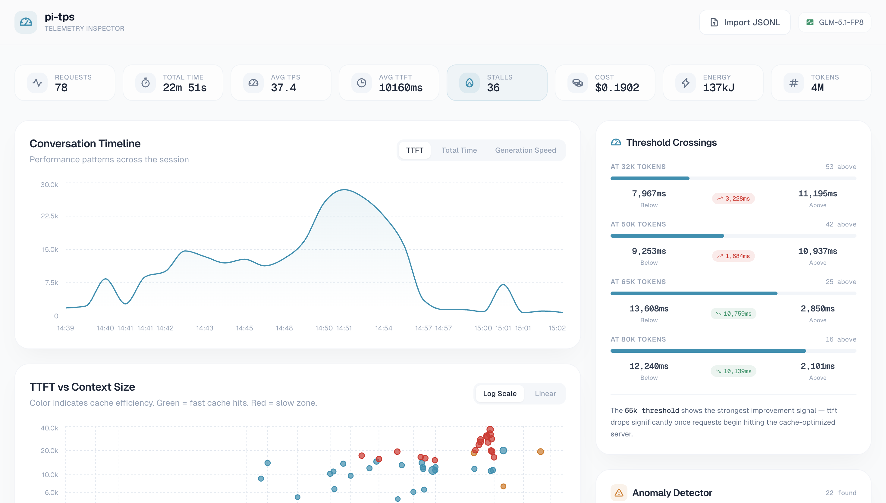

<div align="center">

# 📈 pi-tps-web

**Static telemetry inspector for pi's TPS exports**

_Drag a `.jsonl` session file — no upload, no cloud, no persistence. Everything stays in the browser._

[](https://github.com/earendil-works/pi-coding-agent)
[](./LICENSE)

[](https://railway.com/deploy/pi-tps-web?referralCode=ZqgrJ0)

</div>

---

Built for provider engineers to inspect real-world LLM behavior: how cache hit rates shift as conversations grow, where the slow zones live, and whether routing thresholds land where they should.



## What it shows

- **Conversation Timeline** — TTFT, total time, and generation speed plotted over the session lifetime.
- **TTFT vs Context Size** — Scatter plot with log/linear scale toggle. Color-coded by cache efficiency: fast cache hits in moss green, slow zone (32–65k) in ember, anomalies in amber.
- **TTFT Distribution** — Histogram of where time is spent across all calls, with median and fast/slow call counts.
- **Token Composition** — Stacked bar chart of cache read / new input / output for the last 30 requests.
- **Threshold Crossings** — Compare average TTFT below and above 32k, 50k, 65k, and 80k token thresholds. Progress bars and delta badges tell the routing story.
- **Anomaly Detector** — Automatic identification of cache drops (sub-agent spawns), slow-zone requests, stall spikes, and massive new-input events.
- **Cache Efficiency** — Donut chart with overall cache hit rate, token-type breakdown, and cache-rate bars over time.
- **Request Inspector** — Full list of all calls with inline TTFT, cache-hit badges, and provider/model tags. Model switches, rewinds, and branch summaries appear as contextual markers. Click to drill into one request's tokens, timing, model, and energy footprint.

## Energy data

Energy and cost metrics come from the `pi-neuralwatt-provider` extension. If your `.jsonl` does not include energy events, those fields display `-` instead of hiding the UI entirely.

## Usage

### Standalone web app

```bash
npm install
npm run dev       # local dev
npm run build     # static build to ./dist
```

In production, serve `./dist` from any static host. The sample data at `./public/sample.jsonl` is included for demo purposes only and is removed by the existing `.gitignore`.

### As a pi extension (alongside pi-tps)

pi-tps-web doubles as a pi extension that launches a local web server with the telemetry inspector pre-loaded with your session data. It works alongside `pi-tps` — together, pi-tps tracks TPS and pi-tps-web gives you the visual dashboard.

**Install from npm (recommended):**

```bash
pi install npm:pi-tps-web
pi install npm:@monotykamary/pi-tps        # for telemetry tracking
```

**Or install from GitHub:**

```bash
pi install git:github.com/monotykamary/pi-tps-web
pi install git:github.com/monotykamary/pi-tps
```

**Or try with `-e` for a one-shot test:**

```bash
pi -e /path/to/pi-tps-web
```

> **Git installs:** The `dist/` directory is not tracked in git. On first `/tps-web` invocation, the extension auto-builds it by running `npm install && npx vite build` in the package directory. This only happens once — the build is cached in the git clone at `~/.pi/agent/git/`.

**Usage:**

Once both extensions are loaded, run the `/tps-web` slash command in pi:

```
/tps-web           # Export current branch telemetry → web inspector
/tps-web --full    # Export all branches → web inspector
```

This will:
1. Export telemetry JSONL to `~/.cache/pi-telemetry/` (same as `/tps-export`)
2. Open the folder in Finder/your file manager
3. Start a local HTTP server on port 3141 (auto-increments if taken)
4. Open the web inspector in your browser with the data pre-loaded

Re-running `/tps-web` updates the data and the dashboard auto-refreshes. The web app polls `/api/version` in the background and reloads when new data is available.

## Data format

Expects the newline-delimited JSON format produced by `pi-tps` (via `/tps-export`). The export includes telemetry entries plus structural entries that capture the session's branching story:

```jsonl
{"type":"model_change","id":"...","parentId":null,"timestamp":"...","provider":"neuralwatt","modelId":"moonshotai/Kimi-K2.6"}
{"type":"custom","customType":"tps","id":"...","parentId":"...","timestamp":"...","data":{"model":{"provider":"...","modelId":"..."},"tokens":{"input":...,"output":...,"cacheRead":...},"timing":{"ttftMs":...,"totalMs":...},...}}
{"type":"custom","customType":"neuralwatt-energy","id":"...","parentId":"...","timestamp":"...","data":{"energy_joules":...,"cost_usd":...}}
{"type":"custom","customType":"rewind-turn","id":"...","parentId":"...","timestamp":"...","data":{"v":2,"snapshots":[...],"bindings":[...]}}
{"type":"branch_summary","id":"...","parentId":"...","timestamp":"...","fromId":"...","summary":"..."}
```

### Tree structure

ParentIds are re-chained so the exported entries form a self-contained tree. The root is typically a `model_change` entry with `parentId: null`. Branching (rewinds) creates new children at earlier points in the tree, just like pi's native session tree.
```

## License

MIT
